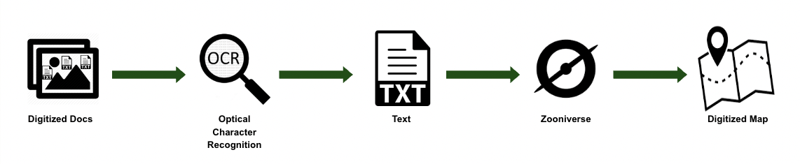

.. The Deed Machine documentation master file, created by
   sphinx-quickstart on Fri Jun 14 13:08:44 2024.
   You can adapt this file completely to your liking, but it should at least
   contain the root `toctree` directive.

The Deed Machine
================

.. image:: https://s3.us-east-2.amazonaws.com/static.mappingprejudice.com/deed-machine/MappingPrejudice_C_600.png
   :width: 200
   :align: right
   :alt: Mapping Prejudice logo

The Deed Machine is a multi-language set of tools that use OCR and crowdsourced transcription to identify racially restrictive covenant language, then map the results.

Racial covenants are clauses that were inserted into property deeds to prevent people who are not white from buying or occupying land. As of June 2024, Mapping Prejudice volunteers have helped to map `more than 52,000 covenanted properties <https://github.com/umnlibraries/mp-us-racial-covenants>`_ across 3 states, with more on the way soon.

The Deed Machine was created at Mapping Prejudice at the University of Minnesota Libraries. Current collaborators include Michael Corey, Suleman Diwan, Justin Schell, and the University of Minnesota Libraries IT staff.

Deed Machine full workflow
--------------------------

.. image:: https://s3.us-east-2.amazonaws.com/static.mappingprejudice.com/deed-machine/Draft%20-%20Updated%20Workflow_alpha.png
  :width: 800
  :alt: A diagram of the components of the Deed Machine. To the left, an initial processing stage using AWS Step Functions is used to output a series of S3 files, which are ingested into a Django project in the center of the diagram.

.. toctree::
   :maxdepth: 2
   :caption: The Deed Machine

   modules/funding.rst
   modules/requirements.rst
   modules/components.rst
   modules/installation.rst
   modules/development.rst
   modules/support.rst
   modules/license.rst

.. toctree::
   :maxdepth: 2
   :caption: Common workflows

   modules/starting-a-workflow.rst
   modules/uploading-files.rst
   modules/ingesting-hits.rst
   modules/uploading-to-zooniverse.rst
   modules/uploading-parcel-data.rst
   modules/downloading-new-results.rst
   modules/mapping-covenants.rst
   modules/manual-data-cleaning.rst
   
.. toctree::
   :maxdepth: 2
   :caption: Step function lambdas

   modules/lambdas/mp-covenants-split-pages.rst

.. toctree::
   :maxdepth: 2
   :caption: Django models

   modules/django-models.rst
   modules/apps-deed-models.rst
   modules/apps-parcel-models.rst
   modules/apps-plat-models.rst
   modules/apps-zoon-models.rst

Indices and tables
==================

* :ref:`genindex`
* :ref:`modindex`
* :ref:`search`
