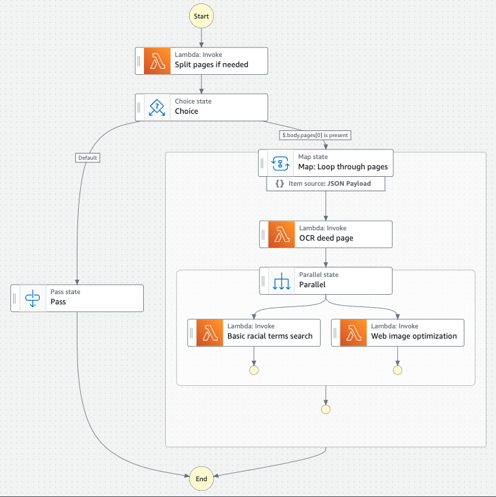

Components
==========

Standalone deed uploader
------------------------

Often deed images are stored on a local machine or network drive, and it's not feasible or efficient to move them. This standalone uploader is designed to avoid the user having to do a full install on this computer.

- `mp-upload-deed-images-standalone <https://github.com/UMNLibraries/mp-upload-deed-images-standalone>`_

Lambda functions used for OCR step machine
------------------------------------------

rocessing are returned, then loop through each page. For each page, lambda invoke OCR's the page. Output from the OCR step is directed to a parallel state that invokes lambdas for a basic racial terms search and Web image optimization.

The individual lambda functions that make up the OCR, term search and web image optimization processes are in separate repositories:

- :ref:`mp-covenants-split-pages`
- :ref:`mp-covenants-ocr-page`
- :ref:`mp-covenants-term-search-basic`

- `mp-covenants-resize-image <https://github.com/UMNLibraries/mp-covenants-resize-image>`_
- `mp-covenants-fake-ocr <https://github.com/UMNLibraries/mp-covenants-fake-ocr>`_