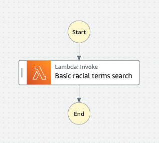
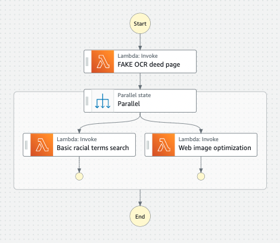

Components
==========

Django core component
---------------------

The `Django component of the Deed Machine <https://github.com/UMNLibraries/racial_covenants_processor>`_ can generally be thought of as the conductor or hub that turns raw processing results into structured data, facilitates the import and export to the Zooniverse crowdsourcing platform, allows for manual GUI editing, and manages final data exports.

- See :ref:`django-models`

Standalone deed uploader
------------------------

Often deed images are stored on a local machine or network drive, and it's not feasible or efficient to move them. This standalone uploader is designed to avoid the user having to do a full install on this computer.

- `mp-upload-deed-images-standalone <https://github.com/UMNLibraries/mp-upload-deed-images-standalone>`_

DeedPageProcessor step function components
------------------------------------------

.. image:: ../_static/DeedMachineStepFunction20240723.png
  :width: 800
  :alt: A diagram showing the logic of the Deed Machine step function as of July 24, 2024. After Start, a lambda invoke splits pages if needed. The output enters a choice state. If no pages ready for processing are returned, the step function ends. If pages ready for processing are returned, then loop through each page. For each page, lambda invoke OCR's the page. Output from the OCR step is directed to a parallel state that invokes lambdas for a basic racial terms search and Web image optimization.

The individual lambda functions that make up the OCR, term search and web image optimization processes are in separate repositories:

- :ref:`mp-covenants-split-pages`
- :ref:`mp-covenants-ocr-page`
- :ref:`mp-covenants-term-search-basic`
- :ref:`mp-covenants-resize-image`

TermSearchRefresh step function components
------------------------------------------

This step function is triggered by the Django management command `trigger_term_search_refresh`. Lambda function for term search is stored in a separate repository and is identical to above:

- :ref:`mp-covenants-term-search-basic`

DeedPageProcessorFAKEOCR step function components
-------------------------------------------------

ptimization.

This step function is triggered by the Django management command `trigger_lambda_refresh`. The individual lambda functions that make up the OCR simulation, term search and web image optimization processes are in separate repositories:

- :ref:`mp-covenants-fake-ocr`
- :ref:`mp-covenants-term-search-basic`
- :ref:`mp-covenants-resize-image`

