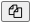

Prepping Zooniverse/uploading to Zooniverse
===========================================

1. If you have not already done so, create a Zooniverse account, create a Zooniverse project, and fill out project information (directions TK)

2. Click on ``Lab`` and then ``Workflows`` in your Zooniverse project

Option 1: Copy an existing workflow
-----------------------------------

This is much simpler than setting up a workflow yourself.

3. Click on the workflow you wish to copy. 

.. .. image:: ../_static/ZooniverseCopyWorkflowIcon.png
..     :align: right
..     :width: 30

4. Click on the "copy workflow" icon to the right of the workflow title: |ico1|

TK TK TK TK TK

Option 2: Creating a workflow from scratch
------------------------------------------

3. If this is your first workflow, click the ``New workflow`` button.

4. Add a title for the workflow that will distinguish which community's records are being transcribed and click ``Add``. This does not need to match the Django workflow name, but if it does not you will need to rename export files when processing transcribed results.

TK TK TK TK

Uploading "hits" to Zooniverse
------------------------------

After you have configured the workflow on Zooniverse, you can upload a batch of records to Zooniverse for community confirmation. These will be selected at random from the set of documents that have not previously been uploaded to this workflow on Zooniverse.

.. code-block:: bash

    python manage.py upload_to_zooniverse --workflow "WI Milwaukee County" -n 200

(Or, optionally) Export manifest in order to upload matching files to Zooniverse (or point to S3 images)

.. code-block:: bash

    python manage.py build_zooniverse_manifest --workflow "WI Milwaukee County"
